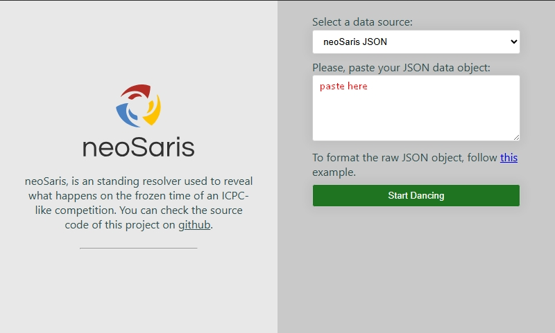

# Tool convert DMOJ format to neoSaris format

## 1. Installation
- Cài đặt các thư viện cần thiết bằng câu lệnh sau:
```bash
pip install -r requirements.txt
```

## 2. Usage
1. Chỉnh sửa file `contestants.json` sao cho phù hợp với danh sách thí sinh theo cấu trúc:
```json
{
    "contestants": [
        {
            "id": 1,
            "name": "hazzu",
            "school": "Hue University of Science"
        },
        {
            "id": 2,
            "name": "fan_rainboy",
            "school": "Hue University of Science"
        },
        {
            "id": 3,
            "name": "Yunan",
            "school": "Hue University of Science"
        },
        ...
    ]
}
```
2. Chỉnh sửa file `problems.json` sao cho phù hợp với danh sách bài toán trong cuộc thi theo cấu trúc:
```json
{
    "problems": [
        {
            "index": "A",
            "name": "icpchusc2025p1"
        },
        {
            "index": "B",
            "name": "icpchusc2025p2"
        },
        {
            "index": "C",
            "name": "icpchusc2025p3"
        },
        ...
    ]
}
```

3. Tạo file `.env` với nội dung như sau:
```
# Tên cuộc thi
CONTEST_NAME = "The ICPC IT HUSC 2025"

# Ngày giờ bắt đầu cuộc thi (format: YYYY-MM-DD HH:MM:SS +00:00)
CONTEST_BEGIN_DATETIME = "2025-03-07 00:00:00 +00:00" 

# API key của trang web DMOJ-based
API_KEY = <điền API key của bạn vào đây>
```

4. Chạy chương trình bằng câu lệnh sau:
```bash
python script.py
```

Sau khi chạy xong, kết quả sẽ được lưu vào thư mục `result` với tên file là `neoSaris.json`.

5. Copy nội dung file `neoSaris.json`, dán vào ô bên dưới và bấm nút `Start Dancing` để khởi chạy web.

